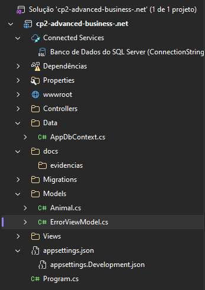
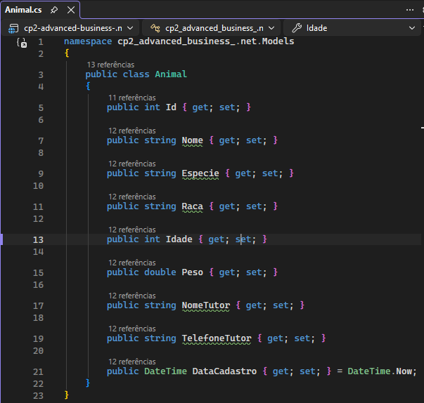
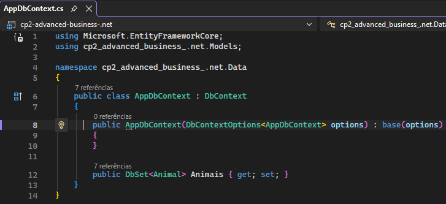
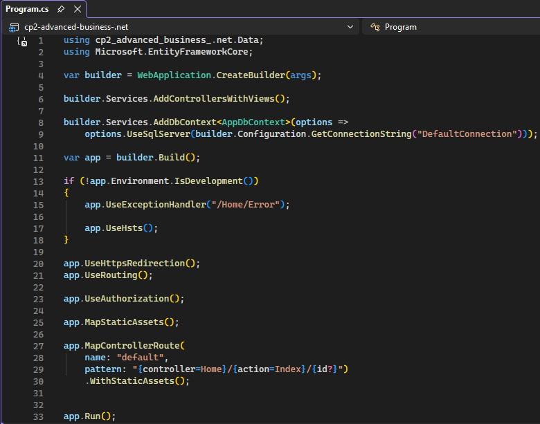
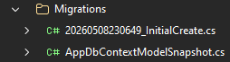
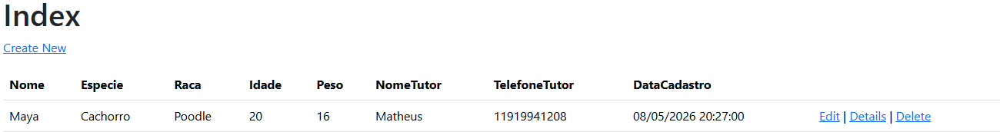
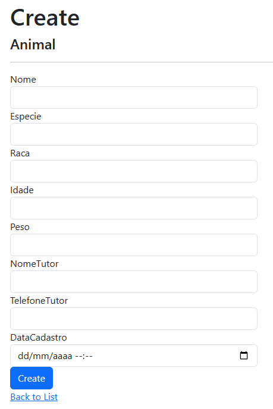
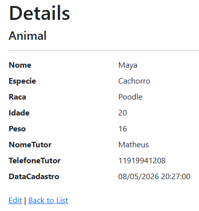
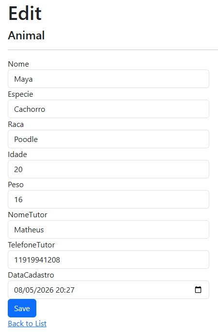
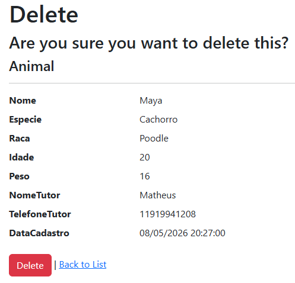

# 🐾 Checkpoint 002 — Sistema de Clínica Veterinária

Projeto desenvolvido em **ASP.NET Core MVC com Entity Framework Core**, implementando um CRUD completo para gerenciamento de animais.

---

## 📌 Objetivo
- Migration ✔
- CRUD completo ✔
- Tabela essencial ✔
- Listagem ✔

---

## 🛠️ Tecnologias
- .NET 10
- ASP.NET Core MVC
- Entity Framework Core
- SQL Server LocalDB

---

## 📂 Estrutura
```
Controllers/
Models/
Views/
Data/
Migrations/
docs/evidencias/
```

---

## ▶️ Execução
```
dotnet restore
dotnet build
dotnet ef database update
dotnet run
```

Acesse:
http://localhost:5298/Animais

---

## 📸 Evidências

### Estrutura do Projeto


### Model Animal


### DbContext


### Program.cs


### Migrations


### Listagem


### Create


### Details


### Edit


### Delete


---

## 🎯 Conclusão
Projeto atende todos os requisitos com EF Core, Migration e CRUD completo.

---

## 👨‍💻 Autor
Matheus Moya de Oliveira		- RM 562822
Ana Carolina Pereira Fontes		- RM 562145
